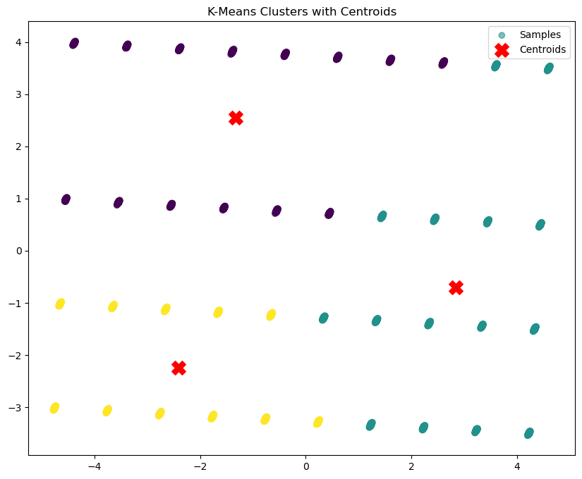

# Health Data Clustering

A machine learning project that applies **unsupervised learning** (KMeans clustering) to segment individuals based on health lifestyle metrics such as exercise frequency, stress levels, and sleep hours. It includes both an **exploratory Jupyter notebook** and an interactive **Streamlit web application**.




# 🧠 Health Data Clustering App


---

## 📁 Project Structure

```
Health_data_Clustering/
├── app.py                         # Streamlit web app
├── clustering_health.ipynb        # Jupyter notebook with analysis
├── clustering_model.pkl           # Serialized model pipeline
├── requirements.txt               # Required dependencies
└── README.md                      # Project documentation
```

---

##  Project Overview

This project analyzes health-related behavior data and clusters individuals into distinct lifestyle groups using unsupervised learning. The app helps users:

* Visualize and understand clustering
* custom data and get cluster predictions
* Export the results to PDF

---

##  Jupyter Notebook: `clustering_health.ipynb`

###  Key Features

* **Data Preprocessing**: Cleaned and scaled health metrics.
* **Feature Selection**:

  * `Exercise_Freq`
  * `Diet_Quality`
  * `Stress_Level`
  * `Sleep_Hours`
* **Modeling**: KMeans clustering with optimal `k` based on Silhouette Score.
* **Visualization**: 2D PCA scatter plots with Plotly.
* **Interpretation**: Descriptive insights for each cluster.

###  Cluster Insights

| Cluster | Label                           | Description                           |
| ------: | ------------------------------- | ------------------------------------- |
|       0 | 🟦 Very Active, Low Stress      | High exercise, good sleep, low stress |
|       1 | 🟨 Least Active, Middle Stress  | Low activity, average stress          |
|       2 | 🟥 High Stress, Irregular Sleep | High stress, poor sleep, low activity |

---

##  Streamlit App: `app.py`

###  What It Does

The app provides a **dashboard** for:

* user input sliders for real-time predictiona
* Viewing predictions summaries
* Predicting cluster labels for each row
* Downloading cluster reports in PDF format

###  UI Features

*  **user input sliders for real-time predictiona**
*  **Show Raw Data & PCA Visualization**
*  **View Cluster Descriptions**
*  **Download Cluster Summary as PDF**
*  **real-time input and health suggestions**

---

##  How to Run

```bash
git clone https://github.com/furqank73/Health_data_Clustering.git
cd Health_data_Clustering
pip install -r requirements.txt
streamlit run app.py
```

---

## 📦 Key Libraries Used

* `scikit-learn` – clustering & preprocessing
* `plotly` – interactive cluster plots
* `streamlit` – web dashboard
* `reportlab` – export results to PDF
* `pandas`, `numpy` – data manipulation

---

##  Future Work

* Add support for other clustering algorithms (e.g., DBSCAN, Agglomerative)
* Use SHAP/LIME for deeper cluster interpretation
* Expand dataset with more demographic features

---

## 🙋‍♂️ Author

**M Furqan Khan**
📌 [LinkedIn](https://www.linkedin.com/in/furqan-khan-256798268/)
📂 [GitHub](https://github.com/furqank73)
🧠 [Kaggle](https://www.kaggle.com/fkgaming)

---